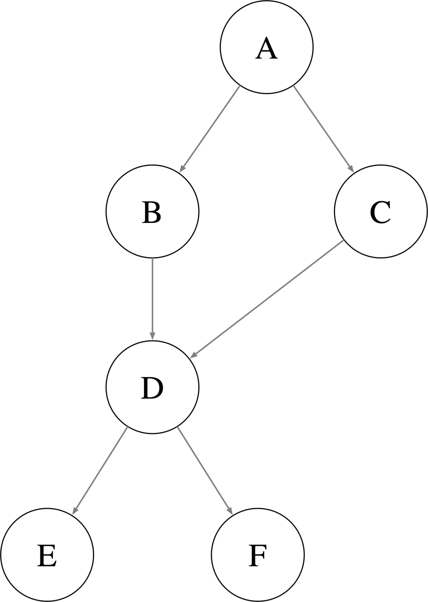
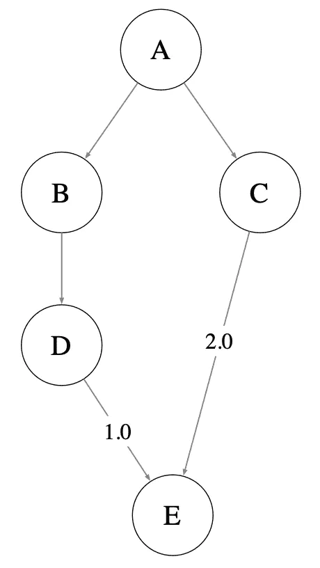
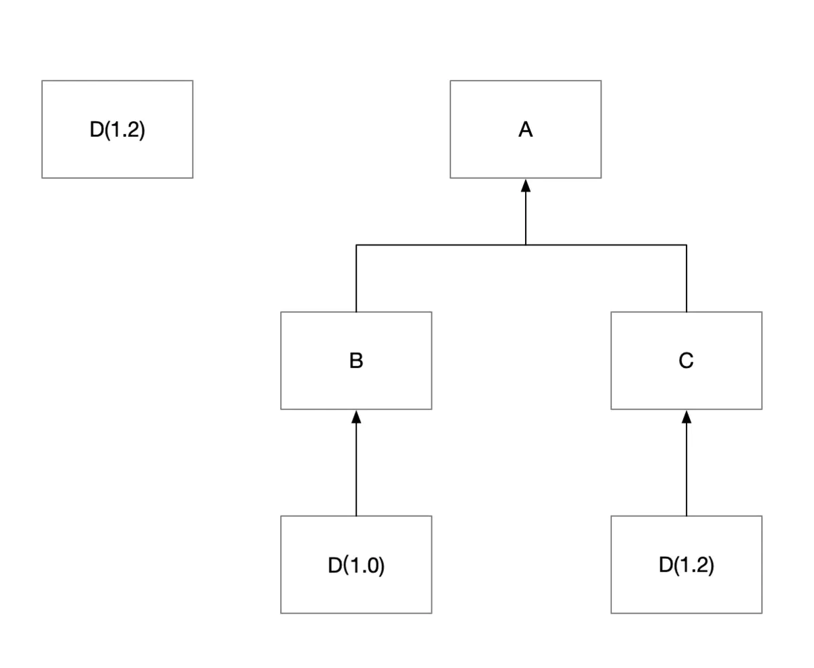

# Maven

## 什么是构建

在编写 Java 代码的时候，我们除了需要调用 JDK 的 API ，还需要调用许多第三方的 API ，假如没有构建工具，你需要把这些 jar 包下载到本地，然后添加进入工程，在 IDE 中进行添加设置。这种方式非常繁琐，并且在遇到版本升级，Git 同步等时候，程序会变得非常脆弱，极易产生未知错误。所以便有了构建工具的产生，它可以让我们专注于写代码，而不需要考虑如何导入 jar 包，如何升级 jar 包版本，以及 git 多人协作等等问题。这是在编译过程中的优势，在运行和发布的过程中，构建工具依然可以帮助我们将工程生成指定格式的文件。

## Dependency Management

现在我们所要讲的依赖范围，正是其中 scope 元素所能选择的内容。在正式介绍依赖范围之前，我们需要知道一件事，那就是：**Maven 项目的环境变量(classpath)有三种，分别为编译时用的环境变量、测试时用的环境变量和运行时用的环境变量**。而依赖范围就是用来控制依赖与这三种环境的关系的：

- `compile`：编译依赖范围，此为默认值，对编译、测试和运行三种环境变量都有效。
- `test`：测试依赖范围，仅对测试环境变量有效。
- `provided`：已提供的依赖范围，对编译和测试环境变量都有效。
- `runtime`：运行依赖范围，对测试和运行环境变量都有效。
- `system`：系统依赖范围，对编译和测试环境变量都有效，但由于此依赖不是通过 Maven 仓库解析的，而且往往与本机系统绑定，可能造成构建的不可移植，因此应该谨慎使用。
- `import`：导入依赖范围，并不会对上面的三种环境变量产生实际的影响。

| 依赖范围(scope) | 编译环境变量有效 | 测试环境变量有效 | 运行环境变量有效 |
| --------------- | ---------------- | ---------------- | ---------------- |
| `compile`       | Y                | Y                | Y                |
| `test`          | N                | Y                | N                |
| `provided`      | Y                | Y                | N                |
| `runtime`       | N                | Y                | Y                |
| `system`        | Y                | Y                | N                |

如上图所示，此为 Maven 的直接依赖范围。除此之外，还有传递性依赖，那么何为传递性依赖呢？

举一个简单的例子，在默认依赖范围的情况下，如果项目 A 依赖 B，B 依赖 C，那么 A 就依赖 C，这时 A 与 C 就是传递性依赖的关系。而且我们称 A 对 B 的依赖为第一直接依赖，B 对 C 的依赖为第二直接依赖，以此类推。

至于为什么要强调**在默认依赖范围的情况下**，则是传递性依赖也是有条件的，具体如下图所示：

| 第一直接依赖 \ 第二直接依赖 | `compile`  | `test` | `provided` | `runtime`  |
| --------------------------- | ---------- | ------ | ---------- | ---------- |
| `compile`                   | `compile`  | ——     | ——         | `runtime`  |
| `test`                      | `test`     | ——     | ——         | `test`     |
| `provided`                  | `provided` | ——     | `provided` | `provided` |
| `runtime`                   | `runtime`  | ——     | ——         | `runtime`  |

观察上表，我们会发现：当第二直接依赖为`compile`时，则依赖关系以第一直接依赖为准；当第二直接依赖为`test`时，则没有依赖关系；当第二直接依赖为`provided`时，只有第一直接依赖也为`provided`时才有`provided`范围的依赖关系；当第二直接依赖为`runtime`时，除了第一直接依赖关系为`compile`时依赖范围为`runtime`，其他三种皆与第一直接依赖范围相同。

---

此外，有一些特殊的依赖情况，可能会造成一些困扰和问题，例如：

- 第一种依赖路径：A -> B -> C -> D(1.0)
- 第二种依赖路径：A -> B -> D(1.1)

其中`->`表示依赖。如上面所示，项目 A 通过不同的路径都依赖到了项目 D，但 D 有两个不同的版本，这时怎么办？

对于这种情况，Maven 给出了一种解决方案，即：**路径最近者优先**。以上面的案例为例，第一种依赖路径的距离为`3`，第二种依赖路径的距离为`2`，因此这时就以第二种依赖路径为准，即依赖`D(1.1)`而不是`D(1.0)`。

不过，大家有没有想过：如果两种依赖路径的距离相同该怎么办呢？例如：

- 第一种依赖路径：A -> B -> D(1.0)
- 第二种依赖路径：A -> B -> D(1.1)

解决方案，即：**第一声明优先**。简而言之，谁先声明就依赖谁。

最后，给出一些比较有用的 Maven 命令，通过这些 Maven 命令，我们能够快速了解 Maven 的依赖情况：

- `mvn dependency:list`：查看 Maven 依赖列表，包直接依赖与传递性依赖。
- `mvn dependency:tree`查看 Maven 依赖树，可以清晰的看出依赖情况。
- `mvn analyze`：分析 Maven 依赖的使用情况。

## 依赖树结构

在 pom.xml 的 dependencies 中声明依赖包后，Maven 将直接引入依赖，并通过解析直接依赖的 pom.xml 将传递性依赖导入到当前项目，最终形成一个树状的依赖结构。

原则：深度优先遍历依赖，并缓存节点剪枝。比如下图：

- A→B→D→E/F
- A→C→D

在第二步`A→C→D`时，由于节点D已经被缓存，所以会立即返回，不必再次遍历E/F，避免重复搜索。

## 依赖冲突

但是假如 2 个包同时依赖了同一个 jar 包，但是这个 jar 包版本不同，规则是什么样的呢？比如下图 A 通过 B 和 D 引入了 1.0 版本的 E，同时 A 通过 C 引入了 2.0 版本的 E。针对这种多个版本构建依赖时，Maven 采用「短路径优先」原则，即 A 会依赖 2.0 版本的 E。如果想引入 1.0 版本的 E，需要直接在 A 的 pom 中声明 E 的版本。

如果 Java 项目过于庞大，或者依赖传递过于复杂时，可以使用 dependencyManagement 定义默认的版本号，一次定义全局生效，避免开发者自行管理依赖的版本。

## 依赖循环

比如：A 依赖了 B，同时 B 又依赖了 A。这种循环依赖可能不会直接显现，但是可能会在一个很长的调用关系显现出来，也可能是模块架构的设计不合理。

我们可以使用 `mvn dependency:tree -Dverbose | grep cycle` 来判断项目中是否存在「循环依赖」。

## 依赖排除

我们可以使用 `exclusion` 来解决依赖冲突，但是 `exclusion` 会降低 Maven 依赖解析的效率，因为对应的 pom 文件不能缓存，每次都要重新遍历子树。需要注意的是，声明exclusion的时候只需要groupId和artifactId，而不需要version元素，这是因为只需要groupId和artifactId就能唯一定位依赖图中的某个依赖。换句话说，Maven解析后的依赖中，不可能出现groupId和artifactId相同，但是version不同的两个依赖。

对于依赖排除：

- `exclusion` 会造成依赖重复扫描和缓存。
- 在距离根节点越远的 `exclusion`，影响的范围越小。
- 依赖树高度越高，引入 `exclusion` 的代价越大。

## 全路径冲突

还有一种特殊的冲突，多个dependency的groupID或artifactID不同(或两者都不同)，但包中存在全路径类名相同的类Java类加载器根据classpath加载类时，根据classpath中jar包出现的先后顺序进行查找类并缓存，后面jar包中的类不使用。这个时候的常见异常就是NoSuchMethodException，NoClassDefFoundError，ClassNotFoundException，NoSuchMethodError等。

如果其中一个jar是我们不需要的，那么排除它就行了。但是，如果这个jar被很多dependency依赖，你需要一个个去写exclusions是不是很麻烦。这时我们可以直接在pom中添加一个空依赖(和想要去掉的jar的groupID，artifactID相同，但是version不同的一个空项目打包上传到远程仓库中)。

## 加载提前

在清楚了Maven的依赖调解规则后，我可以很自然地想到解决方案，就是把我们需要的版本的路径缩短或者声明提前。如下图，比如我们明确需要使用D-1.2，那么我们可以明确在pom依赖中，手动引入D-1.2包，并且将D-1.2的依赖声明写在依赖A的前面即可：

