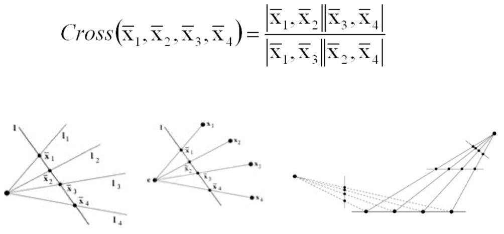

# Homography

> [Homography Transform — Image Processing | by Matt Maulion | Medium](https://mattmaulion.medium.com/homography-transform-image-processing-eddbcb8e4ff7)

Homography, also referred to as planar homography, is a transformation that is occurring between two planes. In other words, it is a mapping between two planar projections of an image. It is represented by a 3x3 transformation matrix in a homogenous coordinates space. Mathematically, the homograohy matrix is represented as:

How does this look like in a coordinate plane?

As observed in the illustration, the element in an image has its projection to the other image in a homogenous coordinate plane, retaining the same information but in a transformed perspective.

---

- General definition:

    A homography is a non-singular, line preserving, projective mapping $\mathrm{h}: \mathrm{P}^{\mathrm{n}} \rightarrow \mathrm{P}^{\mathrm{n}}$.
    It is represented by a square $(n+1)$-dimension matrix with $(n+1)^{2}-1$ DOF

- Note: homographies are not restricted to $\mathrm{P}^{2}$

- Homography = projective transformation = projectivity = collineation 

    > collineation  (a mathematical transformation in which [collinear](https://www.merriam-webster.com/dictionary/collinear) elements (as points or lines) are transferred as corresponding elements to another plane or space)
    >
    > Given a collineation $F$ and a line $L$, we can fix distinct points $p$ and $q$ on $L$, and since $F$ is a bijection, $p^{\prime}=F^{-1}(p)$ and $q^{\prime}=F^{-1}(q)$ are distinct. Let $L^{\prime}$ be the line through $p^{\prime}$ and $q^{\prime}$. Then $F\left[L^{\prime}\right]$ is a line through $p$ and $q$, so it must be $L$. This shows that $F$ is surjective on lines. It is clear that $F$ is also injective on lines, so it is bijective, which is equivalent to the remark as noted.

$$
\mathbf{H}_{P}=\left(\begin{array}{lll}
h_{11} & h_{12} & h_{13} \\
h_{21} & h_{22} & h_{23} \\
h_{31} & h_{32} & h_{33}
\end{array}\right)=\left(\begin{array}{cc}
\mathbf{A} & \vec{t} \\
\vec{v}^{T} & v
\end{array}\right)
$$

**Changes homogeneous coordinate!**
$$
\mathrm{x}^{\prime}=\mathbf{H}_{P} \mathrm{x}=\left[\begin{array}{cc}
\mathbf{A} & \mathrm{t} \\
\mathrm{v}^{\top} & v
\end{array}\right] \mathrm{x} \quad \\
\mathrm{v}=\left(v_{1}, v_{2}\right)^{\top}
$$
8DOF (2 scale, 2 rotation, 2 translation, 2 line at infinity) 

Invariants: cross-ratio of four points on a line (ratio of ratio)

><iframe width="560" height="315" src="https://www.youtube.com/embed/fVJeJMWZcq8" title="YouTube video player" frameborder="0" allow="accelerometer; autoplay; clipboard-write; encrypted-media; gyroscope; picture-in-picture" allowfullscreen></iframe>
>
><iframe width="560" height="315" src="https://www.youtube.com/embed/MlaIWymLCD8" title="YouTube video player" frameborder="0" allow="accelerometer; autoplay; clipboard-write; encrypted-media; gyroscope; picture-in-picture" allowfullscreen></iframe>
