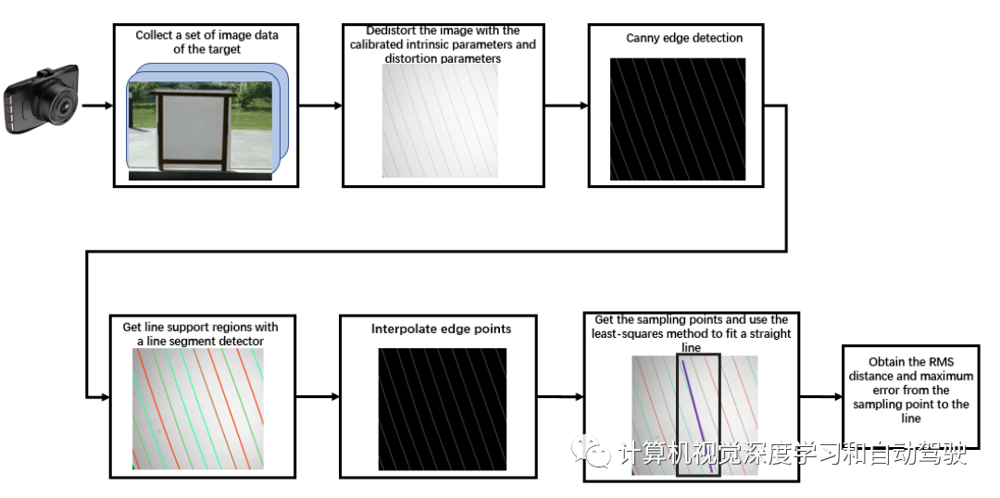
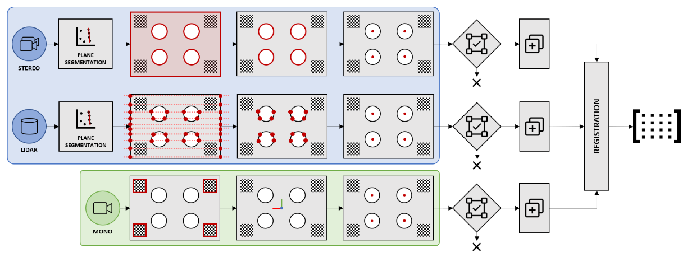
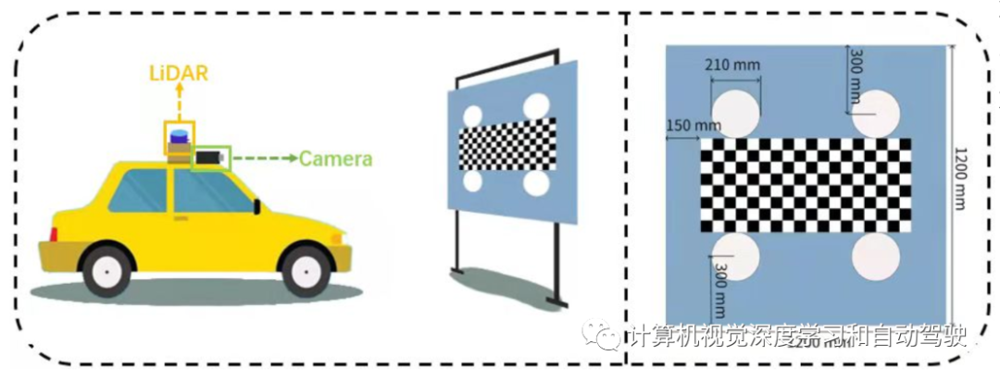
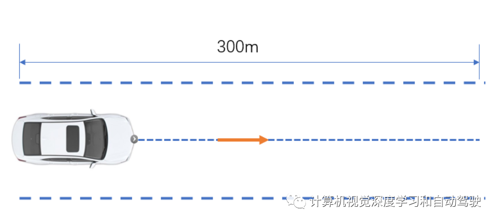
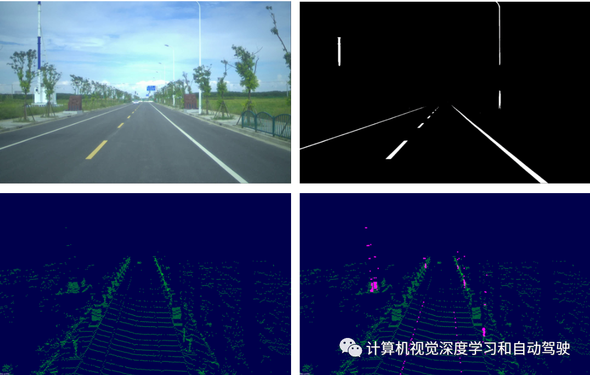
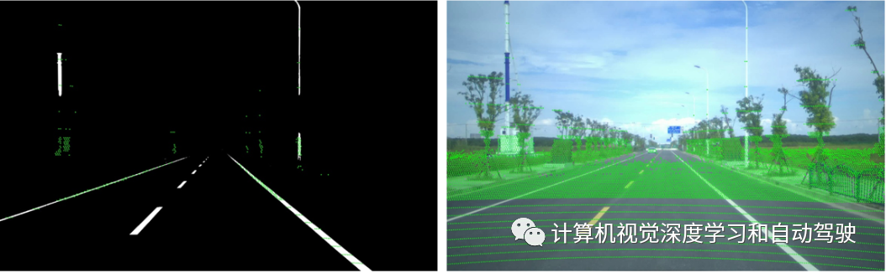
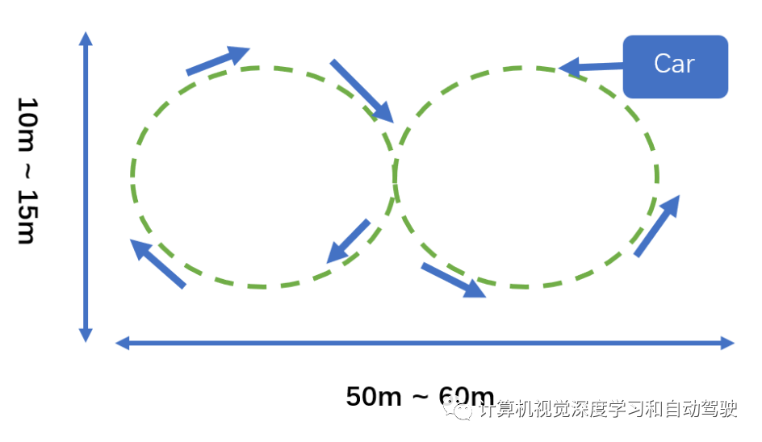
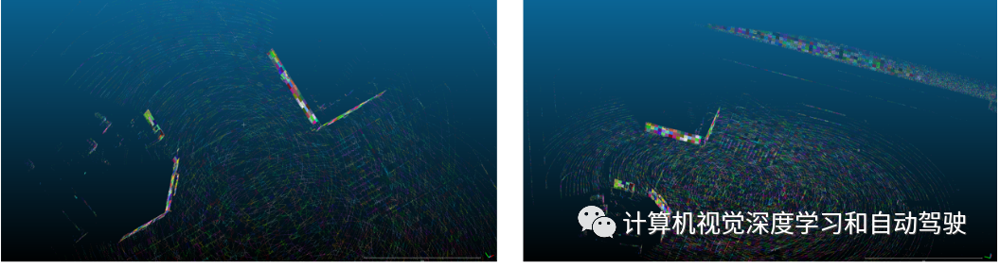
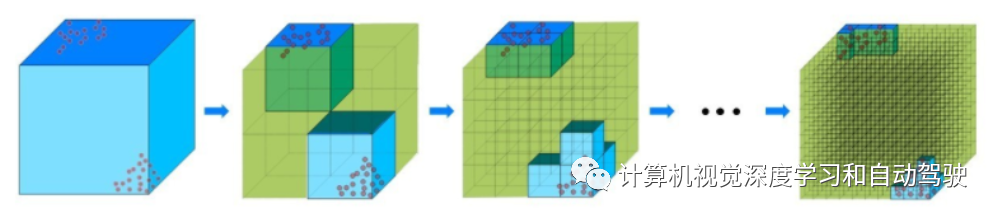

# 多传感器标定

> OpenCalib: A Multi-sensor Calibration Toolbox for Autonomous Driving

一辆车会安装多个传感器，需要通过传感器标定来确定相互之间的坐标关系。因此，传感器标定是自动驾驶的基本要求。传感器标定可分为两部分：内参标定和外参标定。**内参决定传感器的内部映射关系**。例如，摄像头标定内参是焦距和镜头畸变；利用陀螺仪（gyroscope）和加速度计（accelerometer）的零偏、尺度因子和安装误差对IMU内参进行标定；激光雷达内参是内部激光发射器坐标与激光雷达坐标装置之间的转换关系。**外参确定传感器与外部坐标系之间的转换关系**，包括用于旋转和平移的6自由度参数。

在自动驾驶的研究和开发中，传感器之间外参标定是常见的。因为获得的数据类型不同，不同传感器之间标定的最大问题是如何测量最佳值。传感器对的不同，标定误差最小化的目标函数也会不同。外参标定方法通常可分为无目标（targetless）标定和基于目标（target-based）标定。前者是在自然环境中进行的，几乎没有限制，不需要特殊目标；后者需要一个特殊的控制场，并有一个真实值（GT）目标。

---

**基于目标的标定方法**广泛应用于传感器标定过程中。基于目标的方法通常需要手动标定目标，如棋盘、多边形棋盘，这两种模式传感器都可以轻松检测。此外，基于目标的方法可以使用有关目标的先验知识，增强标定结果。目标方法比无目标方法更精确。

传感器的内参标定通常采用目标法。常用的摄像头内参标定方法是Zhang的棋盘法。除了棋盘格图案外，还有一个常见的圆网格，用于标定摄像头内参。一些激光雷达内参标定方法是通过框或面墙执行的。多个传感器之间的外参标定必定常通过基于目标的方法进行，如工厂标定、标定屋。

在某些情况下，基于目标的标定方法是不切实际的，这导致了**无目标标定方法**的发展。无目标方法比基于目标方法更方便，因为不需要设定特定目标。这些方法使用环境特征来完成传感器数据的对应。根据信息提取方法的不同，多传感器在线标定的研究方向可分为三种方法：边缘配准法、互信息法（mutual information）和分割法。一些方法利用道路特征对多个传感器进行自动标定。

---

**基于运动的标定方法**将传感器外参标定视为手眼校定（hand-eye calibration）问题。该方法不需要传感器之间的视场重叠，通常对初始值具有较好的鲁棒性，但精度较低。只要传感器有里程计信息，这个问题就可以转化为求解齐次线性方程组问题。

这个问题有不同形式的解决方案，如四元数形式、对偶四元数（dual quaternion）形式以及螺旋（helical）运动和螺旋轴（helical axis）形式。不同形式解对应相同的方法，但与只能获得旋转标定的其他形式解相比，对偶四元数形式可以额外获得平移标定。然而，这些方法没有充分考虑测量的不确定性，导致标定精度容易受到传感器噪声的影响。

---

**时域标定**也是基于运动标定方法的一个重要组成部分。一般来说，时域标定有三种方法，包括硬件同步、双向通信软件同步和单向通信软件同步。第三种方法，通过两种方式完成，即使用每个传感器的里程计数据，通过优化的解决方案获得时域标定，或通过数据关联获得标定结果。

---

# 基于目标的自动标定

## 摄像头标定

Zhang的方法放置不同姿势的校准板提取棋盘格的角点，并计算摄像头的内参和畸变参数。针孔模型通常用于标定摄像头的内参，但只是摄像头投影过程的简化模型。实际的摄像头镜头组更为复杂，没有绝对的光学中心。由于摄像机内部结构复杂，缺乏一种有效的摄像头内参标定的定量评价方法。

由于每个摄像头镜头的畸变程度不同，因此可以通过摄像头标定来校正镜头畸变，以生成校正的图像。校正的图像对于后续感知或与其他传感器的联合标定至关重要。因此，有必要开发一种失真的定量评估方法，以确保失真标定的准确性。提供一个定量评估摄像头失真的程序（参考论文“**High-precision camera distortion measurements with a “calibration harp“**），易于实现，自动化，用于执行摄像头畸变评估。

失真评估的目标由钓鱼线和半透明纸组成。畸变参数评估流程图如图所示：首先，摄像头用于捕获目标的图像，目标填充整个图像。接着基于摄像头标定参数对该图像进行去失真，以获得校正的图像。然后，直线段检测算法使用Canny描述符在校正的图像中提取直线段。由于用NMS的原因，线段是不连续的，线性插值用于获得连续直线。高斯采样后，得到多个线性采样点。最后，用LS法得到拟合直线。

根据如下公式，得到采样点到拟合直线的均方根距离和最大误差距离，即 评价畸变参数质量的度量指标。回归线可以表示为 $\alpha * x+\beta * y-\gamma=0$ ，这里 假设给定L条直线。
$$
\begin{gathered}
S=\sum_{i=1}^{L} \sum_{i=1}^{N_{l}}\left|S_{l i}\right|^{2}=\sum_{i=1}^{L} \sum_{i=1}^{N_{l}}\left(\alpha_{l} * x_{l i}+\beta_{l} * y_{l i}-\gamma_{l}\right)^{2} \\
d_{\max }=\sqrt{\left(\left(\sum_{l=1}^{L}\left|\max _{i} S_{l i}-\min _{i} S_{l i}\right|^{2}\right) / L\right)}
\end{gathered}
$$

## 激光雷达-摄像头标定

基于目标的激光雷达和摄像头标定方法依赖于观测放置在传感器系统前面的人工标定目标，同时由两个传感器获取特征点的位置。对于激光雷达和摄像头的标定，现有的方法一般是先标定摄像头的内参，然后标定激光雷达和摄像头的外参。

### Automatic Extrinsic Calibration Method for LiDAR and Camera Sensor Setups

该方法包括针对每种模式的稳健参考点提取分支，以及最终的 3D 点配准阶段，在该阶段获得与一对传感器相关的最佳变换。开源代码位于http://wiki.ros.org/velo2cam_calibration.

### Joint camera intrinsic and lidar-camera extrinsic calibration

如果在第一阶段没有正确校准摄像头的内参，则很难精确校准激光雷达-摄像头的外参。为了解决现有方法中摄像机内参标定不准确对激光雷达到摄像机外参的影响，提出一种联合标定方法，开源代码位于https://github.com/OpenCalib/JointCalib.

设计了一种新的标定板图案，如图所示：其中包含一个用于标定内参的棋盘和几个用于定位激光雷达点云的圆孔。

首先用Zhang的方法校准摄像头初始内参和摄像头初始外参；然后，根据这些参数和标定板尺寸计算图像的2D圆中心点。通过提取圆心在激光雷达的位置，利用激光雷达-摄像头的标定参数将圆心3D点投影到图像平面上。计算的2D点和投影的2D点形成多个2D点对。用这些点对之间的欧氏距离来细化标定参数。同时，在优化过程中加入棋盘角点的3D-2D点重投影约束条件。

其目标函数定义如下：
$$
\begin{aligned}
&\mathcal{J}_{\text {sum }}=\alpha \mathcal{J}_{\text {board }}+\beta \mathcal{J}_{\text {lidar }} \\ \\
&\mathcal{J}_{\text {board }}=\sum_{(u, v) \in P_{B}}\left(\left\|u-u_{\text {det }}\right\|_{2}+\left\|v-v_{\text {det }}\right\|_{2}\right) \\ \\
&\mathcal{J}_{\text {lidar }}=\sum_{(u, v) \in P_{L}}\left(\left\|u-u_{\text {det }}\right\|_{2}+\left\|v-v_{\text {det }}\right\|_{2}\right)
\end{aligned}
$$

# 无目标的自动标定

## **IMU 航向标定**

IMU航向标定旨在纠正IMU与车辆之间的前向安装误差。因此，我们仅标定IMU的偏航角补偿以对齐方向，表示为γoffset。从每个时间戳的行驶路线导出车辆的方向，即γgd。估计的驾驶方向和测量的IMU偏航角γIMU之间的偏移量就是标定结果。

基于传感器定位数据，采用b-spline方法对驾驶路线进行平滑处理。此外，并非使用一次行驶行程的所有数据，仅选择直线行驶路线进行以下标定。删除快速改变驾驶方向（如U形转弯）的数据，可以获得实时真实偏航角的精确近似值。
$$
\gamma_{\text {offset }}=\frac{1}{\left|S_{l}\right|} \sum_{l \in S_{l}}\left(\gamma_{\mathrm{g}}^{l}-\gamma_{\mathrm{IMU}}^{l} \right)
$$
建议如图所示录取直线驾驶数据做标定：

## 激光雷达-摄像头标定

激光雷达和摄像头的精确标定是自动驾驶中最常见的标定之一。基于单目视觉的感知系统以较低的成本获得令人满意的性能，但不能提供可靠的3D几何信息。摄像头-激光雷达融合感知是为了提高性能和可靠性。摄像头与激光雷达融合的前提和假设是摄像头与激光雷达之间的精确标定，包括摄像头内参和摄像头与激光雷达的外参。

激光雷达和摄像头精确标定后，由于车辆的长期运动以及温度等其他因素的影响，标定参数将逐渐变得不准确。由于感知融合算法对标定参数的准确性非常敏感，会严重降低感知融合算法的性能和可靠性。在这一点上，通过标定室或手动进行重新标定既麻烦又不切实际，因此开发一种工具来自动标定道路场景中的激光雷达和摄像头，这种方法的具体细节见论文“**CRLF: Automatic Calibration and Refinement based on Line Feature for LiDAR and Camera in Road Scenes**”，arXiv 2103.04558，Mar，2021。

文章提出一种在常见道路场景中对激光雷达和摄像头进行外参标定的方法。该方法完全自动化，效率和准确度也相对较高。首先，利用激光雷达和摄像机采集一组道路场景数据，然后分别从图像和点云中提取车道线和路标等线性特征。如图所示：通过BiSeNet-V2从图像中提取车道线和道路标杆，这些同时通过灰度图和几何方法从点云中提取。

随后，设计一个成本函数来优化初始标定外参，并确保误差在可接受的范围内。可以直接从类别标签“pole”和“road lane”获取来自杆子Qpole和道路车道线 Qlane的像素。结合分割结果，可以得到在像素坐标上两个二值掩码Mline，定义如下：
$$
\mathcal{M}_{\text {line }}(\mathbf{q}):= \begin{cases}1 & \mathbf{q} \in Q_{\text {line }} \\ 0 & \text { otherwise }\end{cases}
$$
从图像和点云中提取线特征后，给出几个成本函数，在给定外部参数（r，t）的情况下，衡量图像和点云的相关性。对掩模Mline应用**距离逆变换**（IDT，inverse distance transformation），避免在后续优化过程中重复的局部极大值。生成的高度图Hline如下：
$$
\mathcal{H}_{\text {line }}(\mathbf{q}):= \begin{cases}\max _{\mathbf{s} \in \mathbb{R}^{2} \backslash Q_{\text {line }}} \gamma_{0}^{\|\mathbf{q}-\mathbf{s}\|_{1}} & \mathbf{q} \in Q_{\text {line }} \\ 0 & \mathbf{q} \in \mathbb{R}^{2} \backslash Q_{\text {line }}\end{cases}
$$
投影成本函数如下:
$$
\mathcal{J}_{\text {proj }}=\tanh \left(\tau_{1} \sum_{\text {line } \in\{\text { pole, lane }\}} \frac{\sum_{\mathbf{p} \in P_{\text {line }}^{L}} \mathcal{H}_{\text {line }} \circ \mathcal{K}(\mathbf{R}(\mathbf{r}) \mathbf{p}+\mathbf{t})}{\left|P_{\text {line }}^{\mathrm{L}}\right|},\right.
$$
该成本函数越大，两个数据域的语义特征匹配越好。如图示出掩模和图像的标定投影结果：

## 激光雷达- IMU标定

激光雷达和IMU的标定也是自动驾驶常用的标定方法之一，其标定精度对激光雷达测绘和定位模块有很大影响。通常，激光雷达的外参标定到IMU时，通过判断激光雷达的局部地图是否良好来判断校准精度。标定过程是通过滑动窗构造的局部地图，求解从激光雷达到IMU的外参。

该标定工具的开发是根据论文“**Balm: Bundle adjustment for lidar mapping**,” *IEEE RAL*, 2021。通过最小化协方差矩阵特征值，特征点分布在局部地图的同一条边或平面。该方法通过最小化协方差矩阵的特征值来最小化特征点到特征平面或边线的距离和，并进行优化达到从激光雷达到IMU的外参标定目的。BA算法最小化每个平面特征点到平面的距离，其公式如下：
$$
\begin{aligned}
\left(\mathbf{T}^{*}, \mathbf{n}^{*}, \mathbf{q}^{*}\right) &=\underset{\mathbf{T}, \mathbf{n}, \mathbf{q}}{\operatorname{argmin}} \frac{1}{N} \sum_{i=1}^{N}\left(\mathbf{n}^{\mathbf{T}}\left(\mathbf{p}_{\mathbf{i}}-\mathbf{q}\right)\right)^{\mathbf{2}} \\
&=\underset{\mathbf{T}}{\operatorname{argmin}}\left(\min _{\mathbf{n}, \mathbf{q}} \sum_{i=1}^{N}\left(\mathbf{n}^{\mathbf{T}}\left(\mathbf{p}_{\mathbf{i}}-\mathbf{q}\right)\right)^{\mathbf{2}}\right.
\end{aligned}
$$
优化后的特征点位置和特征法向量（方向向量）可以写为姿态T的函数，因此只有姿态T需要优化。**adaptive** **voxelization**可以加速搜索特征对应。假设不同扫描的粗略初始姿态可用（例如，从LOAM里程计得到），从默认大小（例如1m）重复对3D空间进行体素化：如果当前体素的所有特征点（来自所有扫描）位于平面或边上（例如，通过检查点协方差矩阵的特征值），则当前体素将与包含的特征点一起保存在内存中；否则，当前体素将分成八份，并继续检查每个八分之一，直到达到最小尺寸（例如，0.125m）。adaptive voxelization生成体素图，其中不同的体素可能具有适应环境的不同大小。

该方法可以获得激光雷达在世界坐标系中任何时间t的姿态，并且可以通过以下公式获得所需的粗略初始外参：
$$
\mathbf{R}_{I}^{\mathrm{L}}, \mathbf{P}_{I}^{\mathrm{L}}=\underset{\mathbf{R}_{I}^{\mathrm{L}}, \mathbf{P}_{I}^{\mathrm{L}}}{\operatorname{argmin}}\left(\left\|\mathbf{R}_{I}^{\mathrm{L}} \mathbf{T}(\mathbf{t})_{I}^{\mathrm{M}} \cdot \mathbf{P}^{\mathrm{L}}-\mathbf{T}(t)^{\mathrm{M}}\right\|^{2}\right)
$$
由于偏移量对系统的影响随时间而逐渐增大，因此局部制图 (local mapping) 优化进 一步校正偏移量。滑动窗的第一个帧表示为P帧，当前帧表示为O帧。根据坐标链规则， 激光雷达坐标之间的转换关系为
$$
\mathbf{T}_{P}^{\mathrm{O}}=\mathbf{T}_{L}^{\mathrm{I}} \mathbf{T}_{I_{o}}^{W} \mathbf{T}_{I_{P}}^{W-1}\mathbf{T}_{L}^{I-1}
$$
据此构建局部地图。建立局部地图后，进一步搜索，每个激光点云帧与当前帧到后续帧局部地图之间的对应关系。

建议根据下图收集数据：标定的自动驾驶车，按照8字轨迹驾驶

标定场景有几个要求：a）确保地面足够平坦；b） 确保周围有足够的特征，如墙壁、车道线、电线杆、静止车辆等；c） 标定的车辆按图所示轨迹循环三次，车速保持在10km/h；d） 尽量不要周围有动态目标，如车辆等。

如图显示了激光雷达到IMU映射的特征提取结果：

## 激光雷达-激光雷达标定

在自动驾驶中，激光雷达扮演着重要的角色。激光雷达可以实时获取周围环境的3D结构信息。它一般可以构建自动驾驶的高精度地图，定位、障碍物检测、跟踪和预测。在自动驾驶汽车上安装单个激光雷达有时无法覆盖汽车周围区域，或者无法满足盲点监控的需要。

因此，有必要适当增加激光雷达的数量以增加可视范围（FOV）。多个激光雷达的数据融合，需要对多个激光雷达的坐标系进行外参标定，获得每个坐标的精确旋转和平移参数，以便后续数据处理。

这里给出一个多激光雷达标定工具。两台激光雷达之间的外参标定分两步实现，即地平面配准和非地面特征点的校准。首先，从地面和非地面点云中提取并分割点云。利用地面法线进行地面配准，得到转角（roll）、俯仰角（pitch）和z轴平移作为初始外参。

然后遍历变换后非地面点云的偏航角（yaw），计算两个激光雷达的最近点距离，得到最小距离的偏航角。随后，通过常规ICP（NICP）算法和基于八叉树（octree）的优化，继续提高标定精度。

在粗略标定中，激光雷达很容易在道路上采集大量的地平面信息。因此，算法的第一步是利用该特征进行粗配准。假设包含最多点的最大平面被视为地平面GP：{a，b，c，d}：
$$
G P:\{a, b, c, d\}=\arg \max _{|p l a n e|}\left|a x_{i}+b y_{i}+c z_{i}+d\right| \leq \epsilon
$$
地平面用于将从属（slave）激光雷达地平面GPs与主（master）激光雷达地平面GPm对齐：
$$
\begin{aligned}
\vec{n} &=\overrightarrow{G P_{m}} \times \overrightarrow{G P_{s}} \\ \\
\theta &=\overrightarrow{G P_{m}} \cdot \bar{G}_{s} \vec{r}_{s}
\end{aligned}
$$
变换矩阵可用罗德里格斯公式计算。值得注意的是，当估计俯仰/横滚（pitch/roll）与实际俯仰/横滚之间的差值为±π时，可能会出现极端情况。因此，该方法需要在标定后检查平面PCs的大多数点是否在地平面上。通过上述措施，可以粗略估计pitch、roll和z。下一步是标定yaw、x和y。

在细化标定中，采用NICP，ICP的一种变型，可以获得更好的性能。假设由于点云的稀疏性，点云特征不明确，难以提取。NICP包含每个点的法线和扩展每个点的感受野，可以丰富点特征。此外，继续使用基于八叉树的优化来最小化姿态误差，如图所示：无点的立方体标记为绿色，反复切割立方体，蓝色/绿色立方体的体积可以测量标定的质量。

# 在线标定

传统的标定方法往往是离线的，需要用手持标定板进行一系列的操作，耗时费力。在线标定方法是指在系统运行开始时或系统运行期间完成标定。该方法不需要手持式标定板，也可以确保足够的精度。

因此，calibration toolbox为用户提供了三种在线标定工具，用于在驾驶过程中自动标定车辆。同样，具有强烈且易于识别的特征（如树木和交通标志）的道路场景将产生更好的校准结果。

## 摄像头-IMU标定

摄像机和IMU之间的在线标定包括时域标定和外参标定。在线标定过程中，需要一组车辆行驶过程中的图像帧数据和IMU测量数据。在第一组帧，用跟踪相关方法执行时域标定。然后，摄像机和IMU之间的时域标定可以表示为：
$$
\mathbf{t d}^{*}=\operatorname{argmax}_{\mathbf{t d} \in \tau^{2}}\left(w_{I}, \omega_{c}\right)
$$
