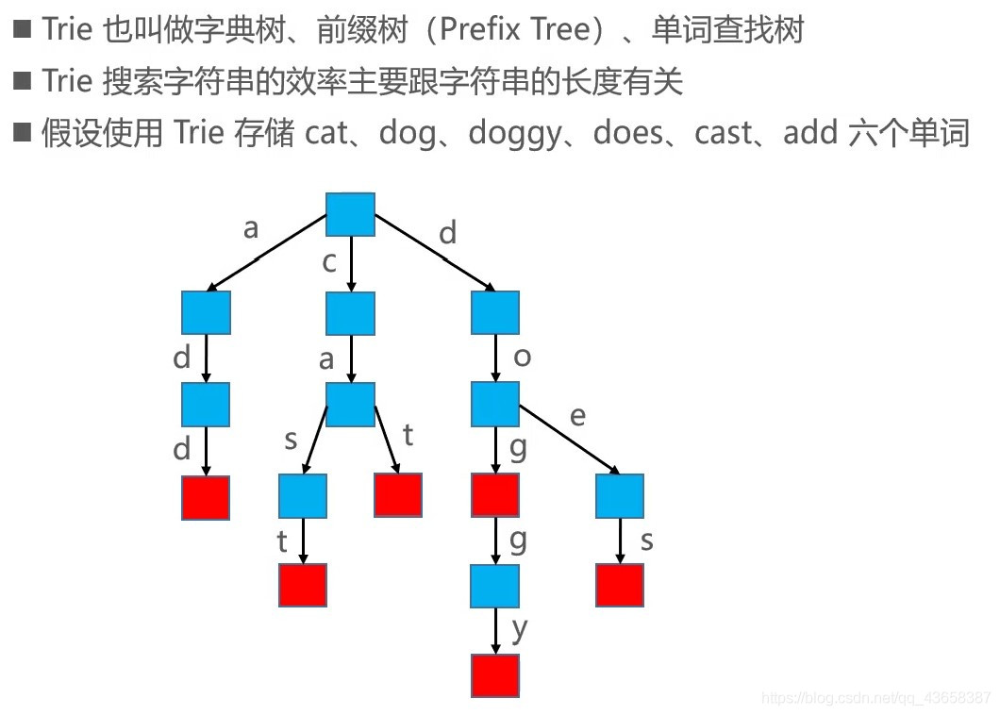


@[toc]

# Trie


◼ Trie 的优点：搜索前缀的效率主要跟前缀的长度有关
◼ Trie 的缺点：需要耗费大量的内存，因此还有待改进

# add

在trie中遍历每个字符，如果存在那么沿着子节点循环查找，否则新加入节点

# remove

首先查找是否存在str的前缀，找到最后最后一个节点

- 当最后一个节点不表示为单词时，或者其还有子节点，则不做任何处理
- 当最后一个节点表示为单词时，需要向上沿parent删除节点直到遇到根节点或者节点属性为word的节点

# code

```java
public class Trie<V> {
	private int size;
	private Node<V> root;
	
	public int size() {
		return size;
	}

	public boolean isEmpty() {
		return size == 0;
	}

	public void clear() {
		size = 0;
		root = null;
	}

	public V get(String key) {
		Node<V> node = node(key);
		return node != null && node.word ? node.value : null;
	}

	public boolean contains(String key) {
		Node<V> node = node(key);
		return node != null && node.word;
	}

	public V add(String key, V value) {
		keyCheck(key);
		
		// 创建根节点
		if (root == null) {
			root = new Node<>(null);
		}

		Node<V> node = root;
		int len = key.length();
		for (int i = 0; i < len; i++) {
			char c = key.charAt(i); 
			boolean emptyChildren = node.children == null;
			Node<V> childNode = emptyChildren ? null : node.children.get(c);
			if (childNode == null) { // 不存在子节点的字符，则加入
				childNode = new Node<>(node);
				childNode.character = c;
				node.children = emptyChildren ? new HashMap<>() : node.children;
				node.children.put(c, childNode);
			}
			node = childNode;
		}
		
		if (node.word) { // 已经存在这个单词
			V oldValue = node.value;
			node.value = value;
			return oldValue;
		}
		
		// 新增一个单词
		node.word = true;
		node.value = value;
		size++;
		return null;
	}

	public V remove(String key) {
		// 找到最后一个节点
		Node<V> node = node(key);
		// 如果不是单词结尾，不用作任何处理
		if (node == null || !node.word) return null;
		size--;
		V oldValue = node.value;
		
		// 如果还有子节点
		if (node.children != null && !node.children.isEmpty()) {
			node.word = false;
			node.value = null;
			return oldValue;
		}
		
		// 如果没有子节点
		Node<V> parent = null;
		while ((parent = node.parent) != null) {
			parent.children.remove(node.character);
			if (parent.word || !parent.children.isEmpty()) break;
			node = parent;
		}
		
		return oldValue;
	}

	public boolean startsWith(String prefix) {
		return node(prefix) != null;
	}
	
	private Node<V> node(String key) {
		keyCheck(key);
		
		Node<V> node = root;
		int len = key.length();
		for (int i = 0; i < len; i++) {
			// 如果node已经为null或者没有子节点，则一定不存在
			if (node == null || node.children == null || node.children.isEmpty()) return null;
			char c = key.charAt(i); 
			node = node.children.get(c);
		}
		
		return node;
	}
	
	private void keyCheck(String key) {
		if (key == null || key.length() == 0) {
			throw new IllegalArgumentException("key must not be empty");
		}
	}
	
	private static class Node<V> {
		Node<V> parent;
		HashMap<Character, Node<V>> children;
		Character character;
		V value;
		boolean word; // 是否为单词的结尾（是否为一个完整的单词）
		public Node(Node<V> parent) {
			this.parent = parent;
		}
	}
}
```


> Reference：[小码哥MJ](https://space.bilibili.com/325538782/)


