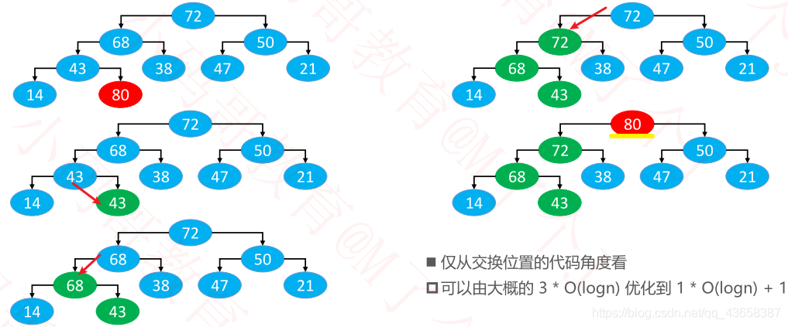

@[toc]

# 最大堆

如果任意节点的值总是 ≥ 子节点的值，称为：最大堆、大根堆、大顶堆
如果任意节点的值总是 ≤ 子节点的值，称为：最小堆、小根堆、小顶堆

索引 i 的规律（ n 是元素数量）
如果 i = 0 ，它是根节点
如果 i > 0 ，它的父节点的索引为 floor( (i – 1) / 2 )
如果 2i + 1 ≤ n – 1，它的左子节点的索引为 2i + 1
如果 2i + 1 > n – 1 ，它无左子节点
如果 2i + 2 ≤ n – 1 ，它的右子节点的索引为 2i + 2
如果 2i + 2 > n – 1 ，它无右子节点

# 添加

◼ 循环执行以下操作（图中的 80 简称为 node）
如果 node ＞ 父节点
✓ 与父节点交换位置
如果 node ≤ 父节点，或者 node 没有父节点
✓ 退出循环



将新添加节点备份，确定最终位置才摆放上去

# 删除

1. 用最后一个节点覆盖根节点
2. 删除最后一个节点
3. 循环执行以下操作
    如果 node < 最大的子节点
    ✓ 与最大的子节点交换位置
    如果 node ≥ 最大的子节点， 或者 node 没有子节点
    ✓ 退出循环
    ◼ 这个过程，叫做下滤（Sift Down），时间复杂度：O(logn)

# heapify

## 自上而下的上滤

每上滤一个就形成一个更大的最大堆
相当于添加：即在添加之前,前面的就已经是最大堆,在其基础上添加

## 自上而下的下滤


有点分治思想
73和34所在的子树分别形成局部最大堆
然后30再去融合,形成整体的最大堆
类似于删除,要进行根节点下滤

## 效率对比


- 上滤：越到后面节点数越多，非常多的节点在做工作量比较大的事情，需要上滤logn

    ◼ 所有节点的深度之和
    仅仅是叶子节点，就有近 n/2 个，而且每一个叶子节点的深度都是 O(logn) 级别的
    因此，在叶子节点这一块，就达到了 O(nlogn) 级别
    O(nlogn) 的时间复杂度足以利用排序算法对所有节点进行全排序

- 下滤相反

    ◼ 所有节点的高度之和
    假设是满树，节点总个数为 n，树高为 h，那么 n = 2^h^ − 1 

    所有节点的树高之和 H(n) =  2^0^ ∗ (h−0) + 2^1^ ∗ (h−1) + 2^2^ ∗ (h−2) + ⋯ + 2^h−1^ ∗ [h−(h−1)]

    H(n) =  h ∗ (2^0^ + 2^1^ + 2^2^ + ⋯ + 2^h−1^) − 1 ∗ 2^1^ + 2 ∗ 2^2^ + 3 ∗ 2^3^ + ⋯ + (h−1) ∗ 2^h^−1

    H(n) =  h ∗ (2^h^ − 1) − [(h − 2) ∗ 2^h^ + 2] // 交错相减 S(h) - 2S(h)

    H(n) =  h ∗ 2^h^ − h − h∗2^h^ + 2^h+1^ − 2 

    H(n) =  2^h+1^ − h − 2 =  2 ∗ (2^h^ − 1) − h =  2n − h =  2n − log~2~(n + 1) = O(n)

# Top K 问题

 从 n 个整数中，找出最大的前 k 个数（ k 远远小于 n ）

◼ 如果使用排序算法进行全排序，需要 O(nlogn) 的时间复杂度
◼ 如果使用二叉堆来解决，可以使用 O(nlogk) 的时间复杂度来解决

新建一个小顶堆
扫描 n 个整数
✓ 先将遍历到的前 k 个数放入堆中
✓ 从第 k + 1 个数开始，如果大于堆顶元素，就使用 replace 操作（删除堆顶元素，将第 k + 1 个数添加到堆中）

即堆顶为最小值，每次都换掉最小值，剩下的都是最大的
**体现了堆的偏序性质，即只要满足大小关系，而不是有序的**

扫描完毕后，堆中剩下的就是最大的前 k 个数

◼ 如果是找出最小的前 k 个数呢？
用大顶堆
如果小于堆顶元素，就使用 replace 操作

# code

```java
public class BinaryHeap<E> extends AbstractHeap<E> {
	private E[] elements;
	private static final int DEFAULT_CAPACITY = 10;
	
	public BinaryHeap(E[] elements, Comparator<E> comparator)  {
		super(comparator);
		
		if (elements == null || elements.length == 0) {
			this.elements = (E[]) new Object[DEFAULT_CAPACITY];
		} else {
			size = elements.length;
			int capacity = Math.max(elements.length, DEFAULT_CAPACITY);
			this.elements = (E[]) new Object[capacity];
            // 这里不让自己的elements直接引用外部传的数组
            // 防止发生外面的数组变化，所以采用深拷贝
			for (int i = 0; i < elements.length; i++) {
				this.elements[i] = elements[i];
			}
			heapify();
		}
	}
	
	public BinaryHeap(E[] elements)  {
		this(elements, null);
	}
	
	public BinaryHeap(Comparator<E> comparator) {
		this(null, comparator);
	}
	
	public BinaryHeap() {
		this(null, null);
	}

	@Override
	public void clear() {
		for (int i = 0; i < size; i++) {
			elements[i] = null;
		}
		size = 0;
	}

	@Override
	public void add(E element) {
		elementNotNullCheck(element);
		ensureCapacity(size + 1);
		elements[size++] = element;
		siftUp(size - 1);
	}

	@Override
	public E get() {
		emptyCheck();
		return elements[0];
	}

	@Override
	public E remove() {
		emptyCheck();
		
		int lastIndex = --size;
		E root = elements[0];
		elements[0] = elements[lastIndex];
		elements[lastIndex] = null;
		
		siftDown(0);
		return root;
	}

	@Override
	public E replace(E element) {
		elementNotNullCheck(element);
		
		E root = null;
		if (size == 0) {
			elements[0] = element;
			size++;
		} else {
			root = elements[0];
			elements[0] = element;
			siftDown(0);
		}
		return root;
	}
	
	/**
	 * 批量建堆
	 */
	private void heapify() {
		// 自上而下的上滤
//		for (int i = 1; i < size; i++) {
//			siftUp(i);
//		}
		
		// 自下而上的下滤
		for (int i = (size >> 1) - 1; i >= 0; i--) {
			siftDown(i);
		}
	}
	
	/**
	 * 让index位置的元素下滤
	 * @param index
	 */
	private void siftDown(int index) {
		E element = elements[index];
		int half = size >> 1;
		// 完全二叉树非叶子数量 = size >> 1
		// 第一个叶子节点的索引 == 非叶子节点的数量
		// index < 第一个叶子节点的索引
		// 必须保证index位置是非叶子节点
		while (index < half) { 
			// index的节点有2种情况
			// 1.只有左子节点
			// 2.同时有左右子节点
			
			// 默认为左子节点跟它进行比较
			int childIndex = (index << 1) + 1;
			E child = elements[childIndex];
			
			// 右子节点
			int rightIndex = childIndex + 1;
			
			// 选出左右子节点最大的那个
			if (rightIndex < size && compare(elements[rightIndex], child) > 0) {
				child = elements[childIndex = rightIndex];
			}
			
			if (compare(element, child) >= 0) break;

			// 将子节点存放到index位置
			elements[index] = child;
			// 重新设置index
			index = childIndex;
		}
		elements[index] = element;
	}
	
	/**
	 * 让index位置的元素上滤
	 * @param index
	 */
	private void siftUp(int index) {
		E element = elements[index];
		while (index > 0) {
			int parentIndex = (index - 1) >> 1;
			E parent = elements[parentIndex];
			if (compare(element, parent) <= 0) break;
			
			// 将父元素存储在index位置
			elements[index] = parent;
			
			// 重新赋值index
			index = parentIndex;
		}
		elements[index] = element;
	}
	
	private void ensureCapacity(int capacity) {
		int oldCapacity = elements.length;
		if (oldCapacity >= capacity) return;
		
		// 新容量为旧容量的1.5倍
		int newCapacity = oldCapacity + (oldCapacity >> 1);
		E[] newElements = (E[]) new Object[newCapacity];
		for (int i = 0; i < size; i++) {
			newElements[i] = elements[i];
		}
		elements = newElements;
	}
	
	private void emptyCheck() {
		if (size == 0) {
			throw new IndexOutOfBoundsException("Heap is empty");
		}
	}
	
	private void elementNotNullCheck(E element) {
		if (element == null) {
			throw new IllegalArgumentException("element must not be null");
		}
	}
}
```

> Reference：[小码哥MJ](https://space.bilibili.com/325538782/)

