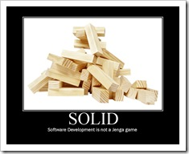
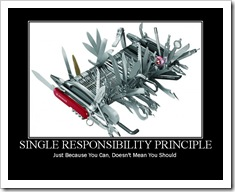
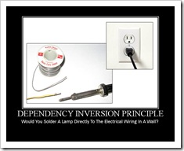

> [SOLID](http://web.archive.org/web/20160521015258/https://lostechies.com/derickbailey/2009/02/11/solid-development-principles-in-motivational-pictures/)

# SOLID Development Principles – In Motivational Pictures

### SOLID

Software development is not a Jenga game.

### Single Responsibility Principle

Just because you can, doesn’t mean you should.

### Open Closed Principle

Open chest surgery is not needed when putting on a coat.

### Liskov Substitution Principle

If it looks like a duck, quacks like a duck, but needs batteries – you probably have the wrong abstraction

### Interface Segregation Principle

You want me to plug this in, where?

### Dependency Inversion Principle

Would you solder a lamp directly to the electrical wiring in a wall?

